::: center
**Kubernetes Cluster - Kubernetes + MySQL + Wordpress**
:::

Clúster Kubernetes en entorno on-premise y despliegue del aplicativo
WordPress en alta disponibilidad. Servicios adicionales, MySQL NDB
Clúster, hipervisor Proxmox y servidor NFS.

# Introduccion

En este documento se muestra el despliegue del aplicativo WordPress y
las implementaciones necesarias para desplegarlo en un clúster de
Kubernetes on-premise.

A lo largo del documento se mostrarán la implementación de un clúster de
Kubernetes en un entorno on-premise, utilizando Proxmox hipervisor de
tipo 1. A partir de este entorno, se han creado y configurado todos los
nodos necesarios para conformar el clúster de Kubernetes, asegurando la
escalabilidad y su óptimo funcionamiento. Implementando redundancia,
tanto en los nodos master como en los worker.

Para garantizar la alta disponibilidad de los datos, se ha implementado
un clúster de base de datos MySQL NDB Cluster, permitiendo una
replicación distribuida y tolerancia a fallos. Además, se configuró un
servidor NFS como solución de almacenamiento persistente, destinado a
soportar los recursos necesarios para los aplicativos desplegados en el
clúster de Kubernetes.

Uso de VIPs (Virtual IPs and Service Proxies) implementación de MetalLB,
ofreciendo así una gestión eficiente del tráfico hacia las aplicaciones
alojadas en el clúster de Kubernetes.

Finalmente, se porcede al despliege del aplicativo WordPress en
configuración de alta disponibilidad, utilizando todos los componentes
antes mencionados para garantizar un servicio robusto y resiliente.
Adicionalmente, se implementó la tecnología de Cloudflare Tunnel para
exponer la aplicación de una forma segura y sencilla, ofreciendo una
capa adicional de protección y simplificando el acceso desde redes
externas.

# Infraestructura

## Hypervisor

La creación de los nodos que compondrán este proyecto, en mi caso serán
creados en el hypervisor Proxmox. En este caso yo cuento con un servidor
dedicado donde se encuentra instalado Proxmox, se podría utilizar un
hypervisor de tipo 2 como VirtualBox y crear todo el entorno en local.

## Clúster Kubernetes

Se crea un clúster con redundancia en los nodos master y worker
garantizando que si algún nodo falla los demás nodos puedan suplirlo. Se
contará con 2 nodos master y 3 worker.

Con el fin de balancear la carga entre los distintos nodos y no requerir
un Load Balancer externo al clúster de Kubernetes, haremos uso de
MetalLB Load Balancer y VIPs (Virtual IPs and Service Proxies).

::: center
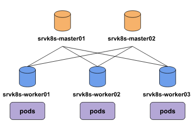
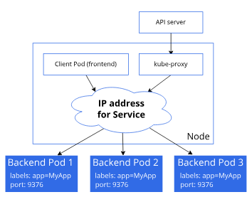
:::

## MySQL NDB Cluster

Se implementa un clúster de MySQL para alta disponibilidad. Esto nos
permite externalizar la base de datos del clúster de Kubernetes y
evitando que la caída del clúster afecte a la base de datos, además de
evitarle esa carga al clúster.

En este caso contamos con una configuración básica de 4 nodos. Contando
con 1 nodo manager, 2 nodos de datos y 1 nodo SQL.

-   **Nodo Manager**\[srvdbm-mgm01\] - Encargado de administrar el
    clúster, tiene conectividad con todos los nodos del clúster.

-   **Nodo Data**\[srvdbm01-2\] - Almacenan los datos creando réplicas
    de los mismos para mantener la alta disponibilidad.

-   **Nodo SQL**\[srvdbm-sql01\] - Nodo sobre el que se realizan las
    querys SQL a la base de datos. Tiene conectividad con los nodos de
    base de datos y con los nodos cliente como en este caso la red del
    clúster de Kubernetes.

::: center
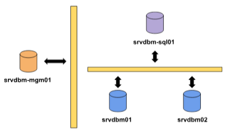
:::

## Servidor NFS

Se implementa un servidor NFS para almacenar los recursos persistentes
de las implementaciones realizadas sobre el clúster de Kubernetes.
Evitando perdida de información, facilitando el escalado del clúster a
futuro y centralizando el almacenamiento lo que nos facilitara la
administración de los recursos.

En caso de ser necesario una aplicación de memoria, está solo tendrá que
llevarse a cabo sobre el servidor NFS.

## Esquema

Esquema general de la infraestructura a implementar, donde observamos la
conectividad entre nodos.

::: center
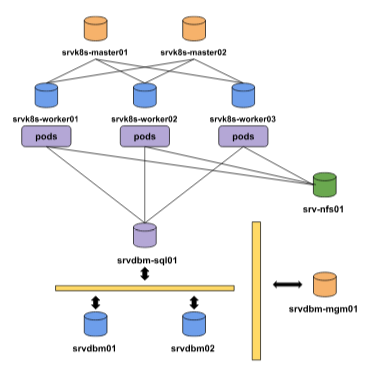
:::

# Implantación infraestructura

## Clúster Kubernetes

Para la creación del clúster, debemos empezar creando las VMs. Yo
realizaré la instalación sobre el sistema operativo Debian 12, con 4
núcleos y 4 GB de RAM, aunque sería recomendable ampliar hasta 8 GB esto
dependerá de los aplicativos a desplegar.

Se crearán 2 máquinas máster y 3 workers. Usaremos una red exclusiva
para el clúster de Kubernetes, a fin de aislar el clúster del resto de
nodos del sistema. Además se le otorgara IPs de dicha red al nodo SQL de
la base de datos y al servidor NFS, ya que requieren ser accesibles por
Kubernetes.

Empezamos configurando la IP y el HostName de los nodos.

::: center
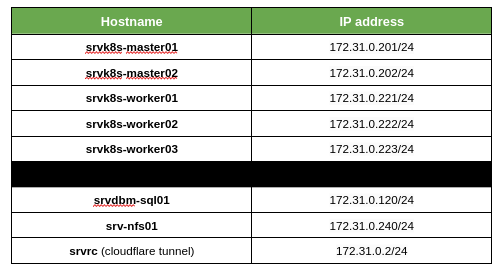
:::

                # hostnamectl set-hostname srvk8s-master01
                # vi /etc/network/interfaces
                # ifdown ens18; ifup ens18

::: center
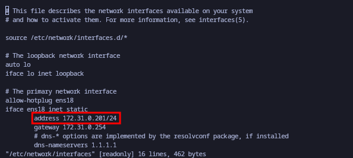
:::

Empezamos con la instalación de Kubernetes, debemos instalar Kubernetes
en los nodos master y worker. Posteriormente, se iniciará el clúster
desde el nodo master y se irán agregando al clúster.

Deshabilitamos swap, ya que si no Kubernetes no nos dejara levantar el
clúster.

        root@srvk8s-master01:~# systemctl --type swap

        UNIT                    LOAD   ACTIVE SUB    DESCRIPTION                            
        *\x2dvg\x2dswap_1.swap loaded active active /dev/mapper/srvk8s--master01--vg-swap_1
            
        root@srvk8s-master01:~# systemctl mask dev-mapper-srvk8s\x2d\x2dmaster01\x2d\x2dvg
        \x2dswap_1.swap
        root@srvk8s-master01:~# sed -i '/ swap / s/^\(.*\)$/#\1/g' /etc/fstab
        root@srvk8s-master01:~# reboot

Configuración he instalación de containerd.

        root@srvk8s-master01:~# cat <<EOF | tee /etc/modules-load.d/containerd.conf 
        overlay 
        br_netfilter
        EOF
        
        root@srvk8s-master01:~# modprobe overlay && modprobe br_netfilter
        
        root@srvk8s-master01:~# cat <<EOF | tee /etc/sysctl.d/99-kubernetes-k8s.conf
        net.bridge.bridge-nf-call-iptables = 1
        net.ipv4.ip_forward = 1 
        net.bridge.bridge-nf-call-ip6tables = 1 
        EOF

        root@srvk8s-master01:~# apt-get update && apt-get install containerd -y
        root@srvk8s-master01:~# containerd config default | tee /etc/containerd/config.tom
        l >/dev/null 2>&1

Revisamos que el SystemdCgroup tenga como valor true, si no lo
modificamos y reiniciamos containerd.

        root@srvk8s-master01:~# grep SystemdCgroup /etc/containerd/config.toml
            SystemdCgroup = true
        root@srvk8s-master01:~# systemctl restart containerd && systemctl enable containerd

Instalación de dependencias, la dependencia nfs-common es para que los
pods se puedan comunicar con el servidor NFS.

        root@srvk8s-master01:~# apt-get install curl pgp -y

        root@srvk8s-master01:~# echo "deb [signed-by=/etc/apt/keyrings/kubernetes-apt-keyring.gpg]
        https://pkgs.k8s.io/core:/stable:/v1.30/deb/ /" | tee /etc/apt/sources.list.d/kubernetes.list

        root@srvk8s-master01:~# curl -fsSL https://pkgs.k8s.io/core:/stable:/v1.30/deb/Release.key | 
        gpg --dearmor -o /etc/apt/keyrings/kubernetes-apt-keyring.gpg

        root@srvk8s-master01:~# apt-get update && apt-get install kubelet kubeadm kubectl nfs-common -y 
        root@srvk8s-master01:~# apt-mark hold kubelet kubeadm kubectl

Creamos el fichero de configuración del clúster par iniciarlo, este será
creado en el master 1, que será quien levante el clúster de Kubernetes.

        root@srvk8s-master01:~# cat kubelet.yaml 
        apiVersion: kubeadm.k8s.io/v1beta3
        kind: InitConfiguration
        ---
        apiVersion: kubeadm.k8s.io/v1beta3
        kind: ClusterConfiguration
        kubernetesVersion: "1.30.0"
        controlPlaneEndpoint: "srvk8s-master01"
        ---
        apiVersion: kubelet.config.k8s.io/v1beta1
        kind: KubeletConfiguration

Iniciamos el clúster, una vez iniciado podemos ir agregando los nodos al
clúster.

        root@srvk8s-master01:~# kubeadm init --config kubelet.yaml --upload-certs

Agregar otro nodo master.

        root@srvk8s-master02:~# kubeadm join srvk8s-master01:6443 --token <token> \
        --discovery-token-ca-cert-hash sha256:<token> \
        --control-plane --certificate-key <token>

Agregar nodo worker.

        root@srvk8s-worker01:~# kubeadm join srvk8s-master01:6443 --token <token> \
        --discovery-token-ca-cert-hash sha256:<token> 

Revisamos que los nodos se han agregado correctamente.

::: center
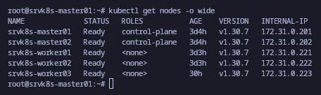
:::

A modo aclaratibo indicaremos el rol de los nodos worker.

        root@srvk8s-master01:~# kubectl \
        label node srvk8s-worker01 node-role.kubernetes.io/worker=""
        root@srvk8s-master01:~# kubectl \
        label node srvk8s-worker02 node-role.kubernetes.io/worker=""
        root@srvk8s-master01:~# kubectl \
        label node srvk8s-worker03 node-role.kubernetes.io/worker=""
        
        root@srvk8s-master01:~# kubectl get nodes
        NAME              STATUS   ROLES           AGE     VERSION
        srvk8s-master01   Ready    control-plane   3d14h   v1.30.7
        srvk8s-master02   Ready    control-plane   3d13h   v1.30.7
        srvk8s-worker01   Ready    worker          3d13h   v1.30.7
        srvk8s-worker02   Ready    worker          3d12h   v1.30.7
        srvk8s-worker03   Ready    worker          39h     v1.30.7

## MetalLB Load Balancer

Instalamos MetalLB, una solución robusta para implementar un balanceador
de carga dentro de nuestro clúster de Kubernetes. MetalLB nos permite
gestionar el tráfico externo y enrutar las solicitudes hacia los Pods
que ejecutan nuestras aplicaciones dentro del clúster.

A través de MetalLB, los servicios expuestos en Kubernetes pueden
utilizar una IP única para ser accesibles desde el exterior. Esto
simplifica el acceso a los servicios desplegados, garantizando una
distribución eficiente del tráfico hacia los Pods correspondientes y
mejorando la experiencia del usuario.

MetalLB se configura como un complemento de red para Kubernetes y es
especialmente útil en entornos on-premise o privados, donde no se
dispone de balanceadores de carga nativos de proveedores de nube como
AWS o GCP. Con MetalLB, combinamos flexibilidad, rendimiento y facilidad
de configuración para gestionar el tráfico.

Habilitar el modo ARP estricto.

        root@srvk8s-worker01:~# kubectl edit configmap -n kube-system kube-proxy

::: center
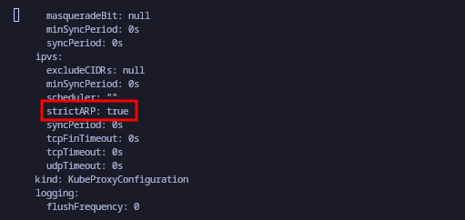
:::

Instalamos MetalLB.

        root@srvk8s-worker01:~# kubectl apply -f https://raw.githubusercontent.com/metallb/metallb/v0.13.12/config/manifests/metallb-native.yaml

Configuración, creamos el pool indicándole el rango de IPs.

        root@srvk8s-master01:~$ cat metallb-ipadd-pool.yaml 
        apiVersion: metallb.io/v1beta1
        kind: IPAddressPool
        metadata:
            name: first-pool
            namespace: metallb-system
        spec:
            addresses:
            - 172.31.0.100-172.31.0.110

        root@srvk8s-master01:~$ cat metallb-pool-advertise.yaml 
        apiVersion: metallb.io/v1beta1
        kind: L2Advertisement
        metadata:
            name: metallb-pool-advertise
            namespace: metallb-system
        spec:
            ipAddressPools:
            - first-pool

        root@srvk8s-master01:~$ kubectl apply -f metallb-ipadd-pool.yaml
        root@srvk8s-master01:~$ kubectl apply -f mmetallb-pool-advertise.yaml

        # Observar que están activos los pods de MetalLB.
        root@srvk8s-master01:~$ kubectl get pod -n metallb-system
        NAME                          READY   STATUS    RESTARTS      AGE
        controller-547c7bdf5c-5xntg   1/1     Running   2 (26h ago)   29h
        speaker-6cv4q                 1/1     Running   2 (26h ago)   29h
        speaker-gbnhx                 1/1     Running   4 (26h ago)   29h
        speaker-lx6z8                 1/1     Running   2 (26h ago)   29h
        speaker-st8mr                 1/1     Running   1 (26h ago)   29h
        speaker-zb6rf                 1/1     Running   4 (26h ago)   29h

## MySQL NDB Cluster

Se instala y configura el clúster según la documentación oficial. Donde
tenemos múltiples opciones, desde paquetes para Debian y RedHat, hasta
la instalación manual de los binarios.

::: center
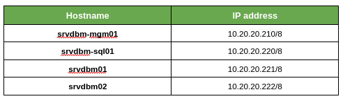
:::

Como se puede observar en la imagen el clúster se encuentra
correctamente configurado.

::: center
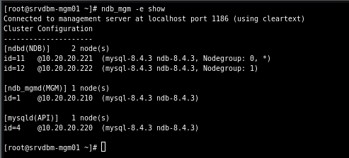
:::

Para realizar querys sobre el clúster usaremos la dirección del nodo
SQL/API 10.20.20.220 o desde el clúster de Kubernetes la dirección
172.31.0.120.

## Servidor NFS

Instalamos un servidor NFS sobre un nodo. Posterior a la instalación
otorgamos permisos sobre un shared a los equipos de la red
172.31.0.0/24, que es donde se encuentra en clúster de Kubernetes.

Installacion del servidor NFS sobre nodo Debian.

        pv1@srv-nfs01:~$ sudo apt install nfs-kernel-server -y
        pv1@srv-nfs01:~$ sudo systemctl start nfs-kernel-server
        pv1@srv-nfs01:~$ sudo systemctl enable nfs-kernel-server

Creamos el shared compartido y otorgamos permisos sobre él a los equipos
de la red 172.31.0.0/24

        pv1@srv-nfs01:~$ sudo mkdir -m 755 /mnt/shared/wordpress/
        pv1@srv-nfs01:~$ sudo chown nobody:nogroup /mnt/shared/wordpress/
        pv1@srv-nfs01:~$ cat /etc/exports
        /mnt/shared/wordpress 172.31.0.0/24(rw,sync,no_subtree_check)
        pv1@srv-nfs01:~$ sudo exportfs -a

Probamos que tenemos acceso a él desde el clúster de Kubernetes.

        root@srvk8s-master01:~# showmount -e 172.31.0.240
        Export list for 172.31.0.240:
        /mnt/shared/wordpress 172.31.0.0/24

        root@srvk8s-master01:~# mkdir /mnt/shared
        root@srvk8s-master01:~# sudo mount \
        -t nfs 172.31.0.240:/mnt/shared/wordpress /mnt/shared
        root@srvk8s-master01:~# df -h /mnt/shared
        S.ficheros                         Tamaño Usados  Disp Uso% Montado en
        172.31.0.240:/mnt/shared/wordpress    48G   1,3G   44G   3% /mnt/shared

## Wordpress

Ahora que contamos con todos los elementos necesarios para la
infraestructura, procedemos a desplegar el aplicativo WordPress en el
clúster de Kubernetes.

**Infraestructura Configurada:**

-   Clúster de Kubernetes: Ya operativo y listo para manejar el
    despliegue de aplicaciones.

-   Base de Datos Externa: Un MySQL NDB Cluster configurado para
    garantizar la alta disponibilidad y accesibilidad de los datos de
    WordPress.

-   Servidor NFS: Configurado en 172.31.0.240 para almacenar de manera
    persistente los datos y archivos generados por WordPress.

**Despliegue de WordPress**

Vamos a desplegar el aplicativo WordPress sobre el clúster de Kubernetes
utilizando una configuración de 3 réplicas, asegurando así la alta
disponibilidad del servicio.

Con esta configuración, cualquier interrupción en un nodo del clúster no
afectará la disponibilidad del sitio web, ya que otras réplicas estarán
listas para asumir la carga.

Además, los volúmenes persistentes almacenarán los datos en el servidor
NFS, garantizando la consistencia de los archivos, independientemente de
qué réplica esté sirviendo las solicitudes.

Descargar e instalar Helm.

        root@srvk8s-master01:~# curl https://raw.githubusercontent.com/helm/
        helm/main/scripts/get-helm-3 | bash

El repositorio de Helm Charts oficial que contiene la imagen de
WordPress se encuentra en Bitnami.

        root@srvk8s-master01:~# helm repo add bitnami \
        https://charts.bitnami.com/bitnami
        root@srvk8s-master01:~# helm repo update

Creamos el usuario y la base de datos para el aplicativo WordPress.

        [root@srvdbm-sql01 ~]# mysql -u root -p
        
        > CREATE DATABASE wordpress;
        > CREATE USER 'wordpress'@'172.31.0.%' IDENTIFIED BY 'PASSWORD';
        > GRANT ALL PRIVILEGES ON wordpress.* TO 'wordpress'@'172.31.0.%';
        > FLUSH PRIVILEGES;
        > SHOW GRANTS FOR 'wordpress'@'172.31.0.%';

Creamos el deployment indicándole el aplicativo a implementar, el uso de
LoadBalancer, la conexión con la base de datos y la creación del volumen
persistente de WordPress que será almacenado en el shared.

        root@srvk8s-master01:~# cat wordpress-nfs-deployment.yaml 
        # WordPress Service
        ---
        apiVersion: v1
        kind: Service
        metadata:
          name: wordpress
          labels:
            app: wordpress
        spec:
          type: LoadBalancer
          ports:
            - port: 80
              targetPort: 80
          selector:
            app: wordpress
            tier: frontend
        
        # PersistentVolume for WordPress
        ---
        apiVersion: v1
        kind: PersistentVolume
        metadata:
          name: wp-pv
        spec:
          storageClassName: manual
          capacity:
            storage: 1Gi
          accessModes:
            - ReadWriteMany
          nfs:
            path: /mnt/shared/wordpress
            server: 172.31.0.240
            readOnly: false
        
        # PersistentVolumeClaim for WordPress
        ---
        apiVersion: v1
        kind: PersistentVolumeClaim
        metadata:
          name: wp-pvc
        spec:
          storageClassName: manual
          accessModes:
            - ReadWriteMany
          resources:
            requests:
              storage: 1Gi
        
        # WordPress Deployment
        ---
        apiVersion: apps/v1
        kind: Deployment
        metadata:
          name: wordpress
          labels:
            app: wordpress
        spec:
          replicas: 3
          selector:
            matchLabels:
              app: wordpress
              tier: frontend
          template:
            metadata:
              labels:
                app: wordpress
                tier: frontend
            spec:
              containers:
                - name: wordpress
                  image: wordpress:latest
                  env:
                    - name: WORDPRESS_DB_HOST
                      value: "172.31.0.120:3306"
                    - name: WORDPRESS_DB_NAME
                      value: "wordpress"
                    - name: WORDPRESS_DB_USER
                      value: "wordpress"
                    - name: WORDPRESS_DB_PASSWORD
                      value: "<PASSWORD_DB>"
                  ports:
                    - containerPort: 80
                  volumeMounts:
                    - name: wordpress-persistent-storage
                      mountPath: /var/www/html
              volumes:
                - name: wordpress-persistent-storage
                  persistentVolumeClaim:
                    claimName: wp-pvc

Una vez configurado el deployment wordpress-nfs-deployment.yaml con
todos los detalles de la implementación (como la configuración del
servidor NFS, la conexión a la base de datos externa y las réplicas),
procedemos al despliege sobre el cluster.

        root@srvk8s-master01:~# kubectl apply -f wordpress-nfs-deployment.yaml 
        service/wordpress created
        persistentvolume/wp-pv created
        persistentvolumeclaim/wp-pvc created
        deployment.apps/wordpress created

Revisamos que los pods del aplicativo se han ejecutado correctamente, en
caso de observar algún fallo podemos usar 'kubectl describe pod -l
app=wordpress', para revisar.

        root@srvk8s-master01:~# kubectl get pods -l app=wordpress
        NAME                         READY   STATUS    RESTARTS   AGE
        wordpress-84d9678558-2lg4g   1/1     Running   0          21s
        wordpress-84d9678558-gxvpc   1/1     Running   0          21s
        wordpress-84d9678558-ldj54   1/1     Running   0          21s
        
        root@srvk8s-master01:~# kubectl get svc
        NAME         TYPE           CLUSTER-IP     EXTERNAL-IP    PORT(S)        AGE
        kubernetes   ClusterIP      10.96.0.1      <none>         443/TCP        3d14h
        wordpress    LoadBalancer   10.100.77.41   172.31.0.100   80:31481/TCP   36s

Con estos pasos, tendremos WordPress desplegado en el clúster de
Kubernetes con:

-   Alta disponibilidad gracias a las réplicas.

-   Datos persistentes almacenados en el servidor NFS.

-   Un servicio accesible mediante una IP gestionada por MetalLB.

## Cloudflare Tunnel

Vamos a hacer uso del tunnel de cloudflare para exponer el aplicativo.
Esto nos permite hacer accesible el aplicativo, sin exponer la IP de
nuestra máquina. Además de permitirnos aplicar políticas como la
restricción de acceso, esto es muy interesante porque podemos restringir
el acceso al panel de administración de WordPress.

**Creación Cloudflare Tunnel** Una vez creamos el tunnel, desde el panel
https://one.dash.cloudflare.com/ de cloudflare, nos indicará los pasos a
seguir para instalarlo en los distintos sistemas. En mi caso lo instaló
sobre un nodo que tiene conectividad con la red 172.31.0.0/24 para poder
acceder al aplicativo.

::: center
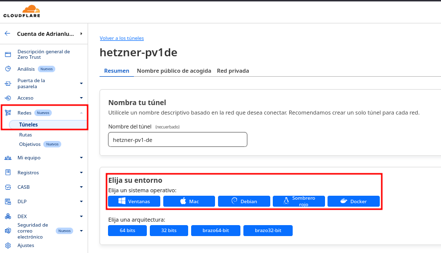
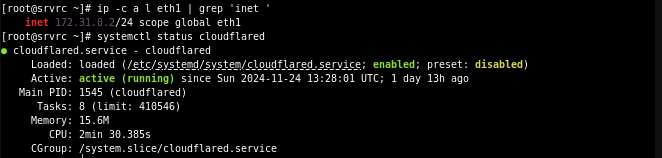
:::

Debemos crear un host público, indicando la IP externa de WordPress.

::: center
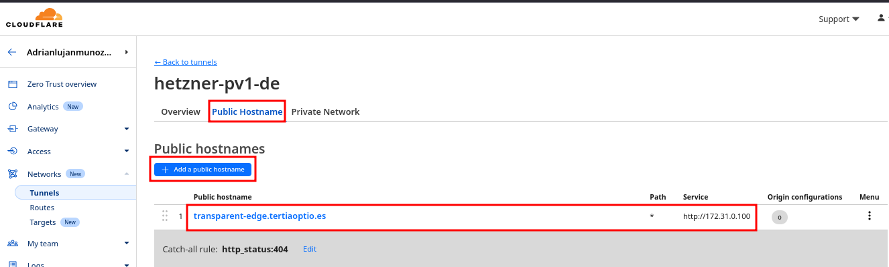
:::

Una vez realizado este proceso el aplicativo ya sería accesible de forma
pública.

-   **URL:** https://transparent-edge.tertiaoptio.es

::: center
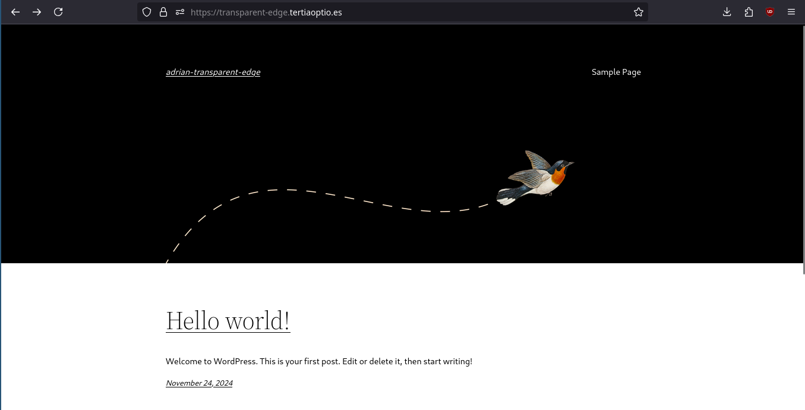
:::

**Agregamos seguridad, restricción acceso panel wp-admin** En el
apartado access, creamos una aplicación de tipo *SELF-HOSTED*.

::: center
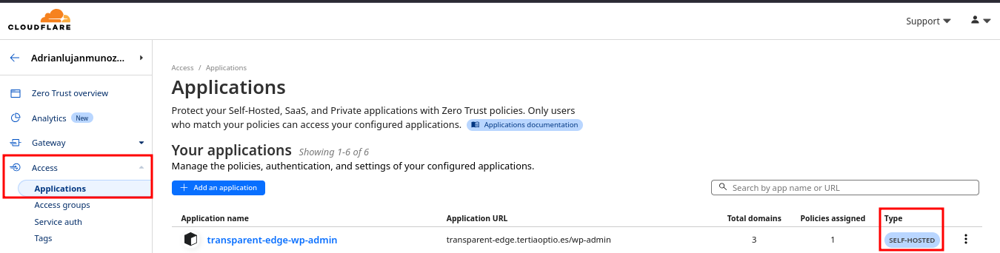
:::

Agregamos las rutas a las que restringiremos el acceso.

::: center
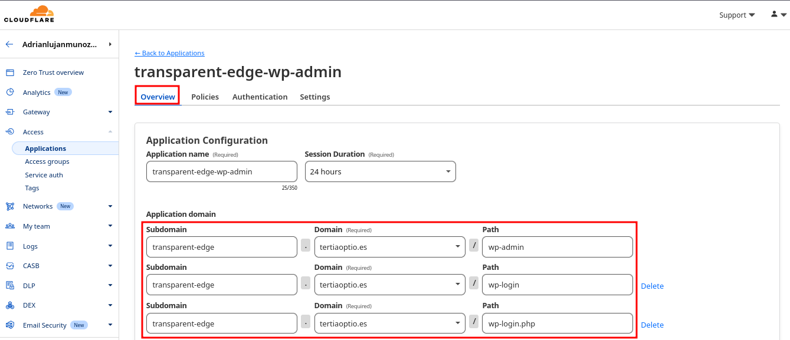
:::

En este caso nos ofrecen dos opciones, la primera nos permite autorizar
un correo haciendo uso del Auth de Google, la segunda nos permite
autorizar correos también, pero los correos autorizados cuando quieran
acceder solicitarán un PIN con el que podrán acceder, dicho PIN es
enviado a su buzón de correo.

::: center
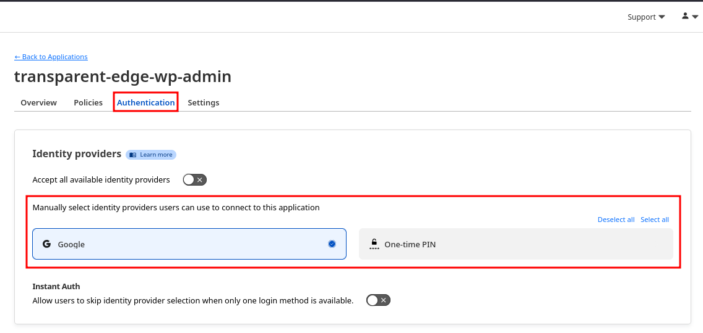
:::

Agregamos una política que nos permitirá controlar los buzones de correo
que posen acceso.

::: center
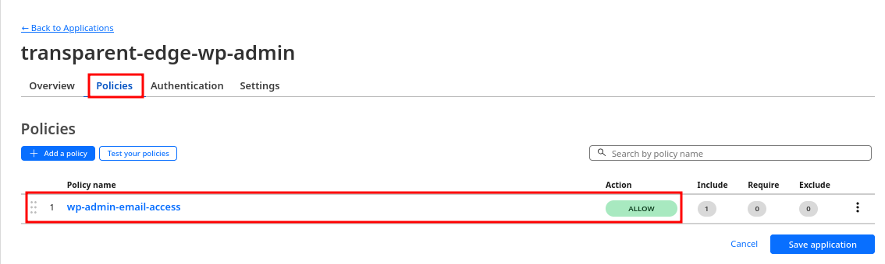
:::

En este caso seleccionamos la opción de agregar buzones de correo
concretos, pero también hay opción de permitir acceso a todos los
buzones de un dominio concreto, esto para una organización es sumamente
útil.

::: center
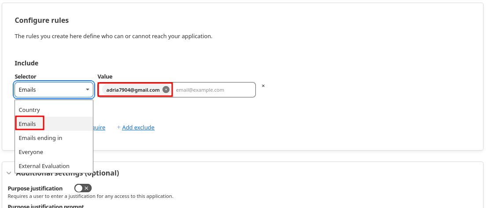
:::

# Comprobaciones

Realizamos comprobaciones.

::: center
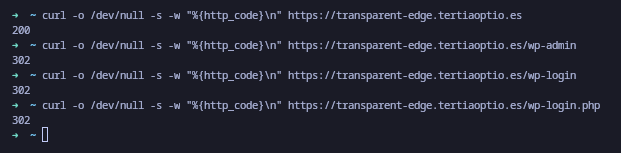

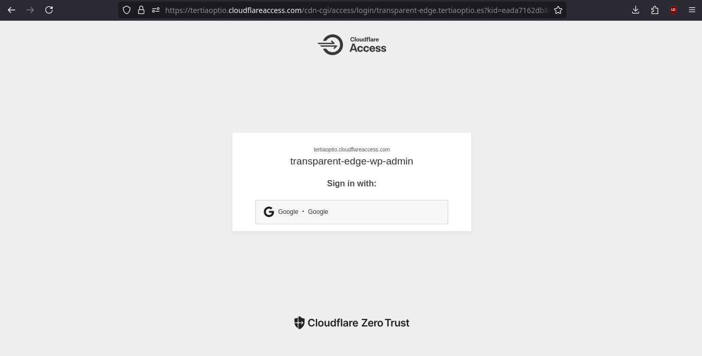
:::

Tras iniciar sesión con el buzón de correo autorizado, se puede acceder
al login de forma correcta.

::: center
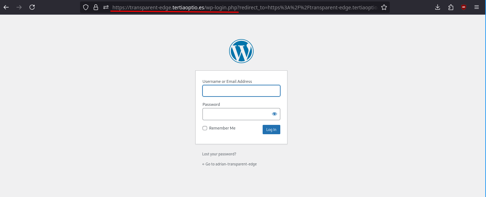
:::

# Mejoras

Para aumentar el rendimiento, la tolerancia a fallos y optimizar la
gestión de recursos, se pueden implementar las siguientes mejoras:

## Hipervisor Proxmox y alta disponibilidad (HA)

Utilizar Proxmox como hipervisor principal incrementa la capacidad de
cómputo y previene caídas. Al crear un clúster de Proxmox, las máquinas
virtuales pueden trasladarse automáticamente a otro servidor en caso de
que uno falle, garantizando accesibilidad y continuidad operativa.

## NAS para almacenamiento centralizado

Implementar un servidor NAS dedicado para almacenar los discos de las
máquinas virtuales elimina la dependencia del almacenamiento local de
Proxmox. Esto permite una mayor flexibilidad, facilita la creacion de
backups y habilita características críticas como la alta disponibilidad.

## Copias de seguridad periódicas

Establecer un sistema de copias de seguridad periódicas (semanales,
mensuales o según la criticidad de los datos) es esencial para la
recuperación ante desastres. Estas copias pueden realizarse en sistemas
externos para garantizar la integridad de la información y la
recuperación eficiente en caso de fallos.

## Segmentación de sistemas de archivos

Configurar los servidores con diferentes filesystem segmentados para
directorios críticos como /var, /var/log, y directorios específicos de
bases de datos como los de MySQL. Esta segmentación ofrece varias
ventajas:

-   Facilita el control del uso de almacenamiento por parte de los
    diferentes aplicativos.

-   Permite ser más selectivo al ampliar el almacenamiento, evitando la
    necesidad de grandes cambios en el sistema completo.

-   Mejora el rendimiento del sistema al distribuir las cargas de
    trabajo.

Por último una visión general del entorno on-premise implementado.

::: center
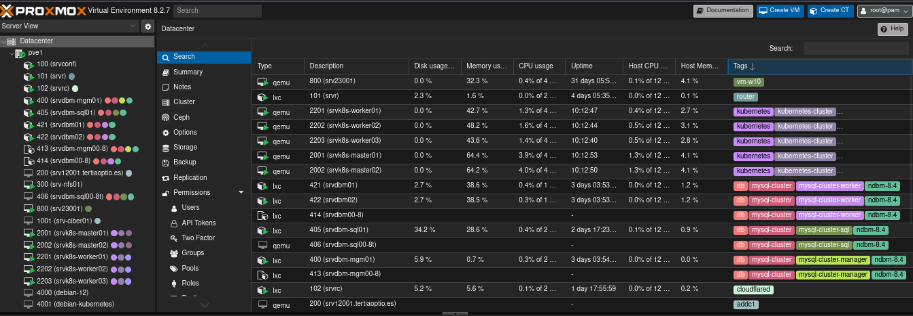
:::
